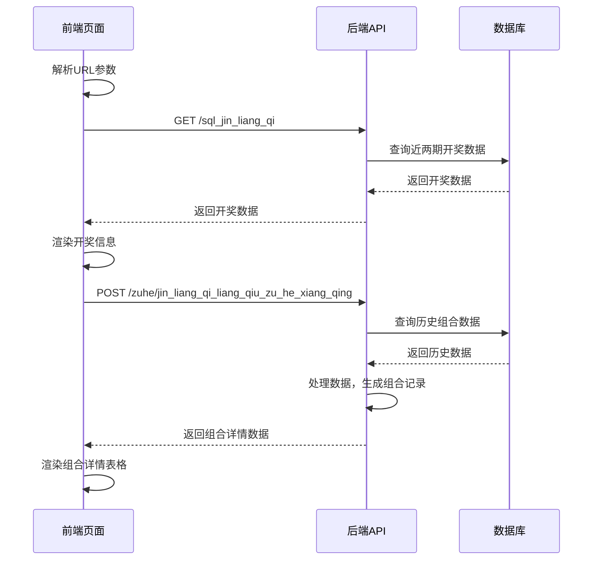

# 近两期两球组合详情页面前后端处理逻辑分析

## 前端处理逻辑

### 1. 页面初始化
- **触发时机**：页面加载完成后，通过 `window.addEventListener('load', renderAllData)` 触发
- **主要函数**：`renderAllData()`

### 2. URL参数解析
- **函数**：`getSelectedCombination()`
- **处理过程**：
  - 从URL中获取 `combination`、`stats_range` 和 `type` 参数
  - 默认值处理：如果参数不存在，使用默认值或从localStorage获取
  - 格式转换：将组合格式化为两位数（如：'7-31-13' → '07-31-13'）
  - 返回解析后的参数：`{ combination: formattedCombination, type, statsRange }`

### 3. 获取最新开奖信息
- **函数**：`huo_qu_jin_liang_qi_kai_jiang()`
- **请求接口**：`GET http://localhost:18889/sql_jin_liang_qi`
- **处理过程**：
  - 发送GET请求获取近两期开奖数据
  - 解析响应：如果 `result.success` 为true，返回 `result.data`
  - 渲染开奖信息：调用 `renderLatestDrawInfo()` 函数

### 4. 获取组合详情数据
- **函数**：`huo_qu_jin_liang_qi_liang_qiu_zu_he_xiang_qing()`
- **请求接口**：`POST http://localhost:18889/zuhe/jin_liang_qi_liang_qiu_zu_he_xiang_qing`
- **请求参数**：
  ```json
  {
    "latest_period": "26002", // 最新期号
    "type": "front", // 类型：front或back
    "combination": "07-31", // 组合球号
    "stats_range": "all", // 统计范围
    "target_ball": 13 // 目标球
  }
  ```
- **处理过程**：
  - 从URL中获取 `type` 参数
  - 构建请求数据
  - 发送POST请求
  - 解析响应：如果 `result.success` 为true，返回 `result.data`

### 5. 数据渲染
- **函数**：`renderCombinationData()`
- **处理过程**：
  - 渲染组合信息（组合球号、统计期数、出现次数等）
  - 渲染记录表格：
    - 遍历组合详情数据
    - 调用 `highlightComboBalls()` 函数生成高亮显示的球号HTML
    - 创建表格行并插入到DOM中
  - 实现分页功能

### 6. 高亮显示球号
- **函数**：`highlightComboBalls()`
- **参数**：`numbers, comboNumbers, isNextDraw = false, targetBall = null, type`
- **处理过程**：
  - 处理不同类型的球号数据（字符串或数组）
  - 根据是否为目标球、是否为组合球、是否为下一期数据等条件，生成不同样式的HTML
  - 返回带有高亮标记的HTML字符串

## 后端处理逻辑

### 1. 路由配置
- **服务器文件**：`服务器.js`
- **路由注册**：
  ```javascript
  // 注册近两期两球组合详情路由
  app.use('/jin_liang_qi_liang_qiu_zu_he_xiang_qing', jinLiangQiLiangQiuZuHeXiangQingRouter);
  // 注册带zuhe前缀的路由
  app.use('/zuhe/jin_liang_qi_liang_qiu_zu_he_xiang_qing', jinLiangQiLiangQiuZuHeXiangQingRouter);
  ```

### 2. 请求处理
- **处理文件**：`近两期两球组合详情.js`
- **请求方法**：POST
- **参数验证**：
  ```javascript
  if (!latest_period || !combination) {
    return res.json({
      success: false,
      message: '缺少必要参数：latest_period 或 combination'
    });
  }
  ```

### 3. 数据库查询
- **查询历史数据**：
  ```sql
  SELECT id, issue, red, blue, draw_date
  FROM lottery_results
  ORDER BY issue DESC
  LIMIT ?
  ```
- **统计范围处理**：如果 `stats_range` 为'all'，不添加LIMIT子句；否则，添加LIMIT限制

### 4. 数据处理
- **数据格式转换**：通过 `processBalls()` 函数将球号数据转换为数组
- **组合匹配**：检查历史数据中是否包含指定组合
- **记录生成**：生成包含 `prev_period`、`prev_draw_balls`、`current_period`、`current_draw_balls`、`next_period` 和 `next_draw_balls` 的记录
- **目标球过滤**：如果指定了目标球，只返回包含目标球的记录

### 5. 响应返回
- **响应格式**：
  ```json
  {
    "success": true,
    "data": [...], // 组合详情记录数组
    "meta": {
      "combination": "07-31-13",
      "stats_range": "all",
      "total_count": 71,
      "type": "first",
      "target_ball": 13
    }
  }
  ```

## 数据流程



## 可能的错误原因

### 1. 前端错误
- **变量作用域问题**：`combinationData` 变量未正确声明，导致无法访问
- **函数参数缺失**：`highlightComboBalls` 函数缺少 `type` 参数，导致条件判断失败
- **数据类型不匹配**：前端期望的数据格式与后端返回不一致
- **API调用参数错误**：请求参数名或格式不正确

### 2. 后端错误
- **参数验证严格**：缺少必要参数或参数格式错误
- **数据库查询错误**：SQL语句错误或数据库连接问题
- **数据处理逻辑错误**：组合匹配算法或数据生成逻辑有误
- **响应格式不一致**：后端返回格式与前端期望不符

### 3. 网络或配置错误
- **跨域问题**：CORS配置不正确
- **端口或地址错误**：API地址或端口配置错误
- **服务器未启动**：后端服务未运行

## 已修复的问题

1. **参数名不一致**：前端请求参数从 `combinations`（数组）改为 `combination`（字符串）
2. **响应处理逻辑错误**：将前端检查响应成功的条件从 `result.code === 200` 改为 `result.success`
3. **数据渲染逻辑错误**：根据后端实际返回的数据结构修改了前端渲染逻辑
4. **变量作用域问题**：在 `try` 块中使用 `let` 关键字声明 `combinationData` 变量
5. **函数参数缺失**：在 `highlightComboBalls` 函数中添加了 `type` 参数
6. **函数调用错误**：修改了 `highlightComboBalls` 函数调用，确保传递 `type` 参数

## 建议的调试方法

1. **前端调试**：
   - 打开浏览器控制台，查看是否有JavaScript错误
   - 检查网络请求，确认API调用是否成功
   - 查看请求和响应数据，确认格式是否正确
   - 添加调试日志，追踪数据处理流程

2. **后端调试**：
   - 查看服务器日志，确认请求是否到达
   - 检查数据库查询语句，确认查询结果是否正确
   - 添加调试日志，追踪数据处理流程
   - 使用API测试工具（如Postman）单独测试API

3. **前后端联合调试**：
   - 确认前后端使用的参数名和格式一致
   - 确认前后端使用的响应格式一致
   - 逐步测试每个环节，定位问题所在

通过以上分析和调试方法，可以逐步定位并解决页面显示"undefined"的问题。